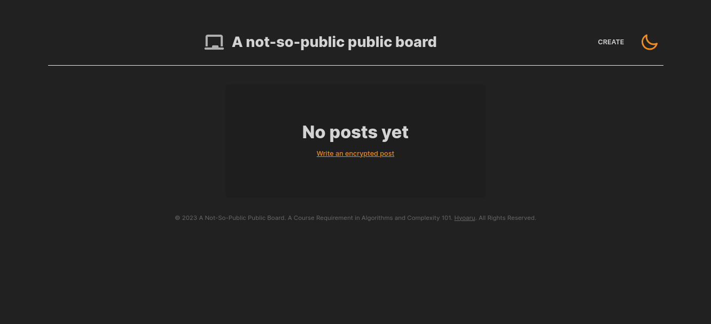
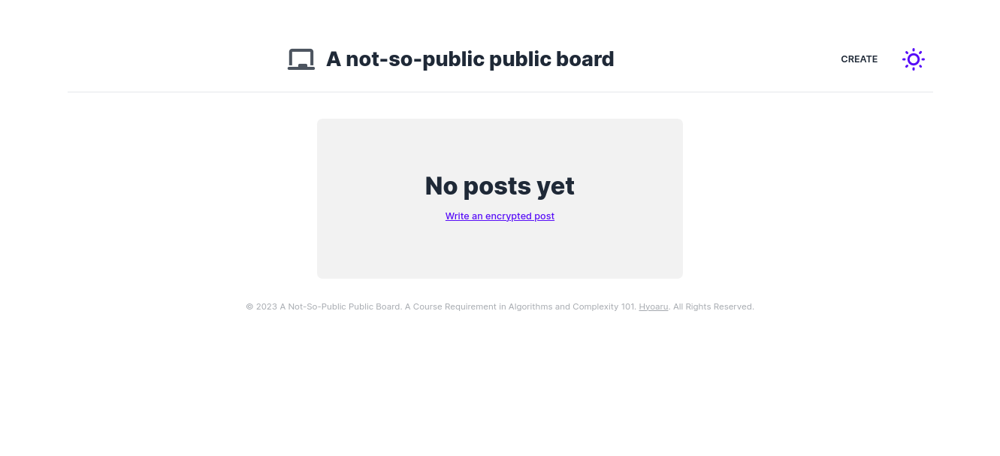
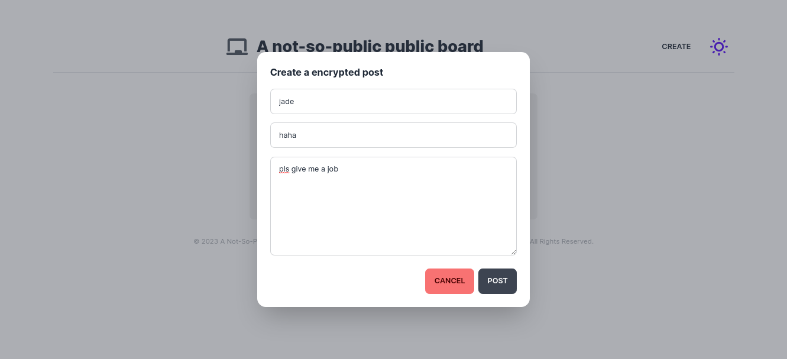
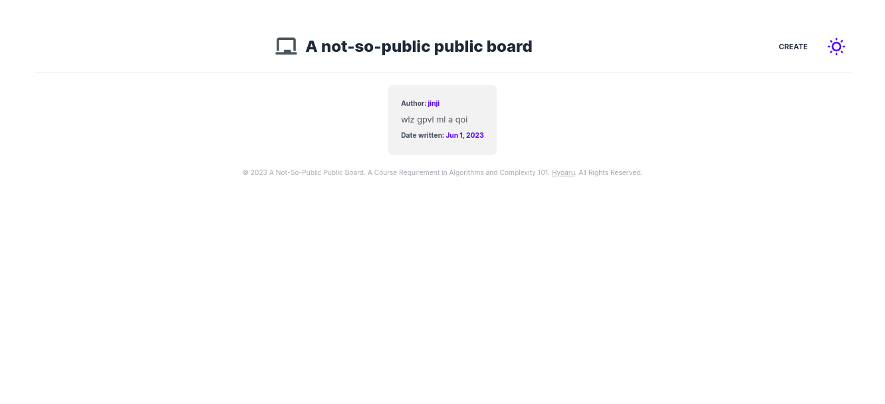
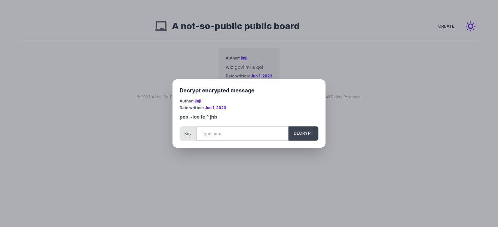
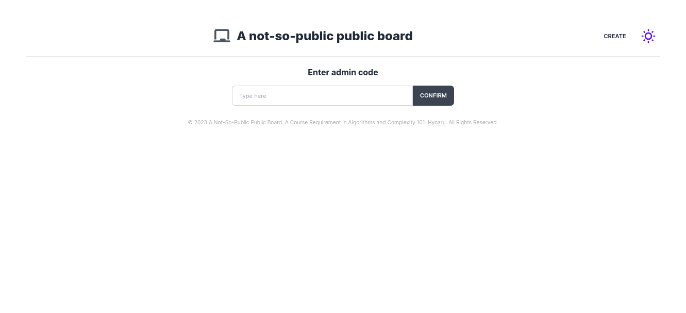
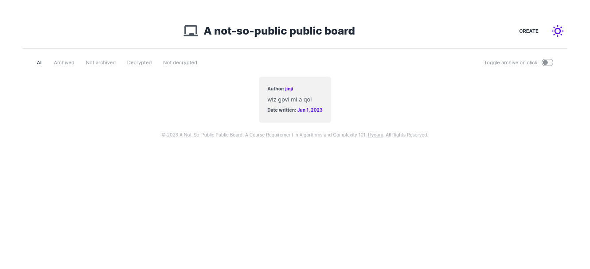

# A Not-So-Public Public Board
A Not-So-Public Public Board is a web application developed as a course requirement for AL101 - Algorithms and Complexity. The application combines the concept of a freedom public board with a twist of encryption, allowing users to post messages publicly while encrypting them using the Vigenère cipher algorithm. The application utilizes ReactJS for the frontend, Flask for the backend, and Flask-RESTful for the API.
* See live: https://hyoaru.github.io/a-not-so-public-public-board/

## Features
* Public Board: Users can post messages on the public board.
* Encryption: The messages posted on the public board are encrypted using the Vigenère cipher algorithm, providing an extra layer of privacy.
* Decryption: Users with the correct decryption key can decrypt the messages and view the original content.
* Admin view: An admin view is available for managing user posts, providing moderation capabilities.

## Previews

## Acknowledgements
* React
* Flask
* Flask-RESTful
* Vigenère cipher

## License
This project is licensed under the [MIT License](LICENSE).
